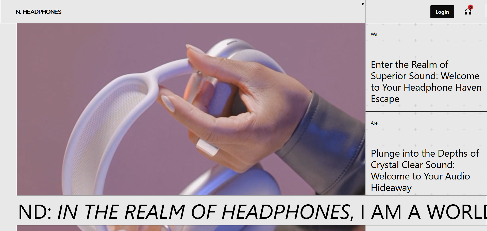
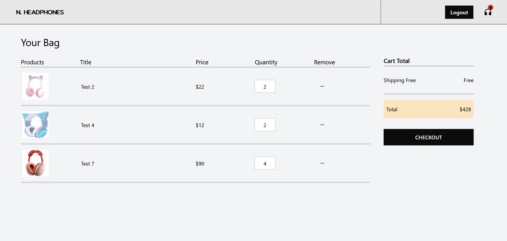

# N.Headphone

N.Headphone is an e-commerce application built using the MERN stack (MongoDB, Express.js, React.js, Node.js) and GSAP. The application provides a seamless shopping experience for users to browse and purchase headphones online.

## Frontend Features

- **Authentication Integration**: Users are required to log in to add items to their cart. User data is retrieved upon login, providing a personalized shopping experience.
- **GSAP Animation**
- **Advanced Cursor**: An interactive cursor is implemented to enhance user engagement and provide a unique browsing experience.
- **Dynamic Styling**: GSAP is used to add dynamic background and color changes during page transitions
- **Image Masking**: CSS clip-path is used to create visually appealing image effects on hover, enhancing the overall look and feel of the application.

## Backend Features

- **User Authentication**: Users can sign up and log in to the application using JWT authentication.
- **Product Management**: The backend provides endpoints for adding, retrieving, and removing products from the database.
- **Cart Management**: Users can add and remove products from their cart, and the backend provides endpoints for retrieving cart data.
- **Middleware**: The backend uses middleware for handling image uploads and enabling CORS.

## Setup

To set up the backend of N.Headphone, follow these steps:

1. Clone this repository to your local machine.
2. Navigate to the project directory in your terminal.
3. create .env in BACKEND and add mongoDB key.
4. Install dependencies by running npm install in each folder - frontend, backend, and admin.
5. To initiate the backend server, execute `node index.js` within the project directory. The server will default to port 4000. For both frontend and admin folders, run "npm run dev".

  ## Screenshot
  

  
